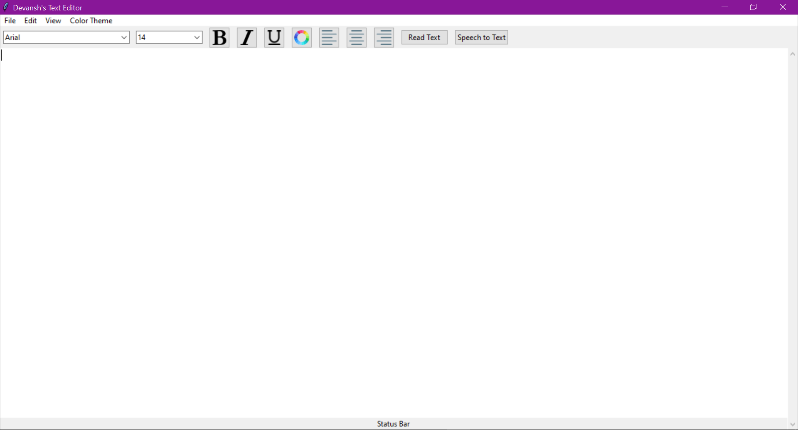

# Text Editor/Notepad
Author: Devansh Tayal

Github: https://github.com/Devansh2005


=========================================================================

# DESCRIPTION

It is a tkinter, Python project (a simple text editor) open for contribution and beginner friendly.
You can start your open-source project from this Text-Editor.

=========================================================================

# Installation

This project requires that you have Python installed. Download it [here](https://www.python.org/). 

It also requires the following Python packages, which can be installed via `pip`:
```
tkinter==8.6
gtts ==2.2.1
pyttsx3==2.90
SpeechRecognition==3.8.1
PyAudio==0.2.11
```
Then run it by double clicking on `dpad.py`!

=========================================================================


# Features !

- Various themes are available.
- All required font styles and colours.

- Text to speech
- Text to speech (Beta).
- Speech to Text

# Editor's Interface Screenshot



=======================================================================

## 📌 Opensource Programs

### This project is a part of following Open Source Program

<table style="width:80%;background-color:white;border-radius:30px;">
    <tr>
  <td>
<center>
  <a href="https://letsgrowmore.in/projects/"></img></a>
  </center>
  </td>
  </tr>
</table>


=======================================================================

# Contributing
Pull requests are welcome. If someone wants to contribute to this project can fork and add the Functionalities. Like adding a loading bar/loading wheel while text-to-speech is processing. Or enhance the GUI.

## Happy Contribution ✨


